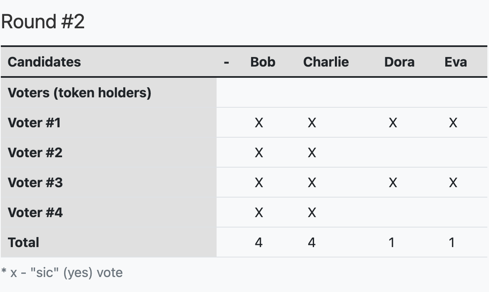

Vara's governance mechanism allows us to evolve gracefully overtime at the ultimate behest of our assembled stakeholders. Our stated goal is to ensure that the majority of the stake can always be in charge of the network.

The goal is to have healthy governance structure in place, including a clear mandate and set of values, so that the community has direction and purpose thorough ensuring the majority of the stake can always command the network.

At it's core, Vara is governed by a multifaceted mechanism that allows us to evolve gracefully overtime at the ultimate behest of our assembled stakeholders. By giving the largest stakeholder i.e. community a majority say in this perpetual system, we are sure to deliver on our promise of fairness and transparency. We designed this model with you in mind.

The Vara governance is designed to be a very efficient and enlightened mechanism for managing the future of the network. This means that it will make sure that its stakeholders are represented, led, and engaged in decision making processes.

As a fundamentional part which provides this mechanism is amorphous state-transition function stored on-chain and represented as platform-neutral intermediate language (WebAssembly).

All changes to the protocol must be agreed upon by stake-weighted [veche](#veche).

## Mechanism

The idea is to create an environment where stakeholders can have their voice can be heard and reflects on decision-making proccess of the network whether the proposal is proposed by the community or the council, and it finally will have to go through a veche to let all holders can make the decision.

For better understanding how the council is formed, please read [this section](#council).

## Veche

Veche are simple and inclusive. Stake based voting schemes that use votes from different organizations to make decisions in the shared ecosystem of a distributed ledger, such as Vechain. Each veche has a specific proposal associated with it that takes the form of a privileged function call, which can switch out the entire code of the runtime in the runtime otherwise require a "hard fork".

A Veche is a discrete event in the Vara, a deadline to vote on the latest version. These events are counted, tallied and then chartered use of these actions should be separated from other init calls by using an identifer for each and can be executited if vote will be approved.

With this binary nature comes simple voting options such as:
"sic" (yes), "ne" (no), or abstaining entirely (abs).

Veche can be initiated through following one of several ways. Publicly submitted proposals, proposals submitted by the council, either through a majority or unanimously, and a proposals submitted as part of the enactment of a prior veche. For this ways that a veche is launched, this is a fixed time of 28 days.

Proposals submitted as part of the enactment of a prior veche it can be set as desired.

Emergency proposals submitted by the Technical Committee and approved by the Council deal with major problems with the network that need to be "fast-tracked". These will have a shorter enactment time.

All veche have an _enactment delay_ associated with them. This is the period between the veche ending and, assuming the proposal was approved, the changes being enacted.

Veche is considered _baked_ if it is closed and tallied. Again, assuming the proposal was approved, it would be scheduled for enactment. Veche is considered _unbaked_ if it is pending an outcome, i.e. being voted on.


### Proposing a Veche

#### Public Veche

Anyone can make a propose and If someones wants to agree with it, they may deposit the same amount of tokens which is called _endorsing_. A proposal with the highest amount of bonded support will be selected to be a veche in the next voting cycle, and when the voting period ends, those who pledged their tokens to the proposal will be able to vote on it.

The bonded tokens will be released once the proposal is brought to a vote.

There can be a maximum of 100 public proposals in the proposal queue.

#### Council Veche

Unanimous Council - when all members of the council agree on a proposal, it can be moved to a veche. This veche will have a negative turnout bias (that is, the smaller the amount of stake voting, the smaller the amount necessary for it to pass - see [Adaptive Quorum Biasing](#adaptive-quorum-biasing).

Majority Council - when agreement from only a simple majority of council members occurs, the veche can also be voted upon, but it will be majority-carries (51% wins).

There can only be one active veche at any given time, except when there is also an emergency veche in progress.

#### Voting Timetable

The veche to be voted upon alternates between the top proposal in the two queues.
The first one is a queue for Council-approved proposals and a queue for publicly submitted proposals.
The second one is a queue for for publicly submitted proposals.
Every 28 days, a new veche will come up for a vote, assuming there is at least one proposal in one of the queues.
The veche to be voted upon alternates between the top proposal in the two queues.
Multiple veche cannot be voted upon in the same period, excluding emergency veche.
An emergency veche occurring at the same time as a regular veche is the only case that multiple veche will be able to be voted on at once.

If the given queue whose turn it is to create a veche that has no proposals (is empty), and proposals are waiting in the other queue, the top proposal in the other queue will become a veche.

The "top" proposal is determined by the amount of stake bonded behind it.

#### Voting on a Veche

In order to vote, a voter generally must lock up their tokens for at least the period of delay after the end of the veche. This is done in order to ensure that there is minimal economic interest in the outcome and to prevent the sale of votes. You can also vote without any blocking at all, but your vote is worth a small fraction of a regular vote, given your stake. At the same time, the presence of a small number of tokens does not mean that the holder cannot influence the result of the veche due to the timing.

<!-- Vara Coin (Token) then called as VARC -->

For Example:

Peter: Votes `No` with 10 VARC for a 128 week
lock period => 10 x 6 = 60 Votes

Logan: Votes `Yes` with 20 VARC for a 4 week
lock period => 20 x 1 = 20 Votes

Kevin: Votes `Yes` with 15 VARC for a 8 week
lock period => 15 x 2 = 30 Votes


Even though combined both Logan and Kevin vote with more VARC than Peter, the lock period for both of them is less than Peter, leading to their voting power counting as less.

#### Tallying

Depending on which entity proposed the proposal and whether all council members voted yes, there are three different scenarios. We can use the following table for reference.

|          **Entity**          |                   **Metric**                   |
| :--------------------------: | :--------------------------------------------: |
|            Public            | Positive Turnout Bias (Super-Majority Approve) |
| Council (Complete agreement) | Negative Turnout Bias (Super-Majority Against) |
| Council (Majority agreement) |                Simple Majority                 |

Also, we need the following information and apply one of the formulas listed below to calculate the voting result. For example, let's use the public proposal as an example, so the `Super-Majority Approve` formula will be applied. There is no strict quorum, but the super-majority required increases with lower turnout.

```
approve - the number of `sic` votes

against - the number of `ne` votes

turnout - the total number of voting tokens (does not include conviction)

electorate - the total number of tokens issued in the network
```

##### Super-Majority Approve

A `positive turnout bias`, whereby a heavy super-majority of sic votes is required to carry at low turnouts, but as turnout increases towards 100%, it becomes a simple majority-carries as below.


##### Super-Majority Against

A `negative turnout bias`, whereby a heavy super-majority of ne votes is required to reject at low turnouts, but as turnout increases towards 100%, it becomes a simple majority-carries as below.


##### Simple-Majority

Majority-carries, a simple comparison of votes; if there are more sic votes than ne, then the proposal is carried, no matter how much stake votes on the proposal.


More about where these above formulas come from, please read the
[democracy pallet](https://github.com/paritytech/substrate/blob/master/frame/democracy/src/vote_threshold.rs).

As an example:

If we only have 1500 VARC tokens in total and that this is a `public proposal`.

- Alice: 500 VARC
- Bob: 100 VARC
- Charlie: 150 VARC
- JJ: 150 VARC
- Ken: 600 VARC


Alice: Votes `Yes` for a 4 week lock period => 500 x 1 = 500 Votes

Bob: Votes `Yes` for a 4 week lock period => 100 x 1 = 100 Votes

Charlie: Votes `No` for a 16 week lock period => 150 x 3 = 450 Votes


- approve = 600
- against = 450
- turnout = 750
- electorate = 1500


Since the above example is a public veche, `Super-Majority Approve` would be used to calculate the result. `Super-Majority Approve` requires more `sic` votes to pass the veche when turnout is low, therefore, based on the above result, the veche will be rejected. In addition, only the winning voter's tokens are locked. If the voters on the losing side of the veche believe that the outcome will have negative effects, their tokens are transferrable so they will not be locked into the decision. Moreover, winning proposals are autonomously enacted only after some enactment period.

#### Voluntary Locking

VARC utilizes an idea called `Voluntary Locking` that allows token holders to increase their voting power by declaring how long
they are willing to lock up their tokens, hence, the number of votes for each token holder will be calculated by the following formula:

```
votes = tokens * conviction_multiplier
```

The conviction multiplier increases the vote multiplier by one every time the number of lock periods double.

The maximum number of "doublings" of the lock period is set to 6 (and thus 32 lock periods in total), and one lock period equals `115200 days`. Only doublings are allowed.

You cannot lock for 24 periods and increase your conviction by 5.5.

While a token is locked, you can still use it for voting and staking; you are only prohibited from transferring these tokens to another account.

Votes are still "counted" at the same time (at the end of the voting period), no matter for how long the tokens are locked.

#### Adaptive Quorum Biasing

VARC introduces the concept of "adaptive quorum bias" which acts as a lever that the council can use to change the effective a qualified majority is required to facilitate or hinder the acceptance of a proposal in the event that there is no clear majority of votes supporting or opposing it.

If a publicly presented veche only has a 25% turnout, the "sic" vote must reach 66% for it to pass, as we have applied a "Positive Turnout Bias".

In contrast, with a turnout of 75%, the number of "sic" votes should reach 54%, meaning that the required supermajority decreases as turnout increases.

When the council unanimously proposes a new proposal, the veche is put to a vote using a "negative turnout bias". In this case, it is easier to pass this proposal at a low turnout and requires a supermajority to reject. As more token holders participate in voting, the bias approaches the simple majority of carries.

Referring to the image above, when a convention has a turnout of only 25%, the number of "sic" votes must reach 34% for it to pass.

In short, low turnout requires a supermajority to reject a proposal, which means that a lower threshold of "sic" votes must be reached, but as turnout increases to 100%, it becomes a simple majority.

All three vote counting mechanisms—majority win, overwhelmingly approve, and overwhelmingly oppose—equate to a simple 100% turnout majority vote system.

<!--

## Council

To represent passive stakeholders, Vara introduces the idea of ​​"council". The Council is a network organization consisting of several members, each is represented as an account on the network. On Var, the council currently consists of `13 members`.

Along with the control of the treasury, the council is called upon primarily for three tasks of government: to propose a reasonable veche, to cancel an undeniably dangerous or evil veche, and to elect a technical commission.

For a veche to be proposed by the council, a strict majority of the members must be in favour, with no veto. The right of veto can only be exercised by a member once in respect of any single proposal;
if, after a deliberation period, the proposal is resubmitted, they cannot veto it a second time.

Council proposals adopted by a supermajority of `3/5 (60%)`, but not supported by unanimous votes, will proceed to the public session under a neutral voting scheme with a majority vote. In the event that all council members voted for the proposal, the vote is considered unanimous and becomes a veche with a negative adaptive quorum bias.

-->

<!--

### Cancelling

The proposal may be revoked if the [technical committee](#technical-committee) unanimously agrees to do so, or if the root source runs the feature. The deposit of the canceled offer is forfeited.

In addition, a two-thirds majority of the council can cancel the veche. This can act as a last resort if a problem is found in the veche proposal, such as a bug in the runtime code that will be installed in the proposal.

If the cancellation is controversial enough that the board fails to win a two-thirds majority, then the decision on the fate of the proposal will be left to the interested parties en masse.

-->

### Blacklisting

The proposal may be blacklisted by root origin. The blacklisted offer and associated meetings (if any) are immediately [cancelled](#cancelled). Also, the hash of a blacklisted offer cannot reappear in the offer queue. The blacklist is useful in removing erroneous
offers that can be sent with the same hash.

Seeing their proposal removed, an applicant who is not properly familiar with the democratic system of Vara may be tempted to resubmit the same proposal. However, this is a far from reliable method of preventing invalid offers from being submitted - a single character change in the offer text will also change the hash of the offer, invalidating the hash blacklist.

<!--

### How to be a council member?

All stakeholders are free to signal their approval of any of the registered candidates.

Council elections are handled by the same [Phragmén election](https://en.wikipedia.org/wiki/Phragmen%27s_voting_rules) process that
selects validators from the available pool based on nominations. However, token holders' votes for councillors are isolated from any of the nominations they may have on validators. Council terms last for one day.

At the end of each term, Phragmén election algorithm will iterate, selecting one seat at a time, according to the following rules:

- Voters submit their ballots, marking which candidates they approve.
- Ballots will not be modified after submission.
- An initial load of `0` is set for each ballot.
- The candidate who wins the next available seat is the one where the ballots of their supporters would have the least average (mean) cost if that candidate wins.
- The `n` ballots that approved that winning candidate get `1/n` added to their load.
- The load of all ballots that supported the winner of this round are averaged out so that they are equal.
- If there are any more seats, go back to `step 3`. Otherwise, the selection ends.

And the result will choose the new councillors based on the vote configurations of all voters. The election also chooses a set number of runners up which is currently 12 that will remain in the queue with their votes intact.

As opposed to a "first-past-the-post" electoral system, where voters can only vote for a single candidate from a list, a Phragmén election is a more expressive way to include each voters' views.
Token holders can treat it as a way to support as many candidates as they want. The election algorithm will find a fair subset of the candidates that most closely matches the expressed indications of the electorate as a whole.

Token Holders (Voters) can vote for multiply candidates in one round. Let's take a look at the example below.


The above example shows that candidate Charlie wins the election in round 1, while candidates A, B, D & E keep remaining on the candidates' list for the next round.



For the top-N (say 4 in this example) runners-up, they can remain and their votes persist until the
next election. After round 2, even though candidates B & C get the same number of votes in this
round, candidate C gets elected because after adding the older unused approvals, it is higher than B.

-->

<!--

### Prime Members

Council that is the embodiment
[Substrate Collective Pallet](https://github.com/paritytech/substrate/tree/master/frame/collective) implements what is called a _prime member_ whose vote acts as the default vote for other members who cannot vote before timeout.

The main member is selected based on the [Borda count](https://en.wikipedia.org/wiki/Borda_count).

The appointment of the chief board member is to ensure a quorum even if several members
abstain from voting. Council members may be tempted to vote "soft reject" or "soft approve" by not voting and allowing others to vote. The existence of a prime member forces the councilors to express their votes clearly or take their votes into account when making decisions that the prime minister voted for.

-->

<!--
## Technical Committee

The Technical Committee is a group of Vara Host teams that have successfully implemented the software and therefore represent the interests of these users. The TC plays an important role in the governance process and assists the [Council](#council) in making strategic decisions about the project. It is made up of the Council and includes all developers currently working on Vara.
Teams are added to or removed from the TC by a simple majority vote of the Council.

The purpose of TC is to protect against malicious veche, fix bugs, reverse erroneous runtime updates, or add new but battle-tested features. TC has the ability to speed up proposals with the Democracy palette, and this is the only source that can trigger quick tracking feature. TC as a “unique source” that cannot generate offers, but can track them quickly.

A fast-acting veche is the only type of veche that can operate simultaneously with another active veche. Thus, during a fasting veche, one can have two valid veche at the same time. Voting for one does not prevent the user from voting for another.

-->
